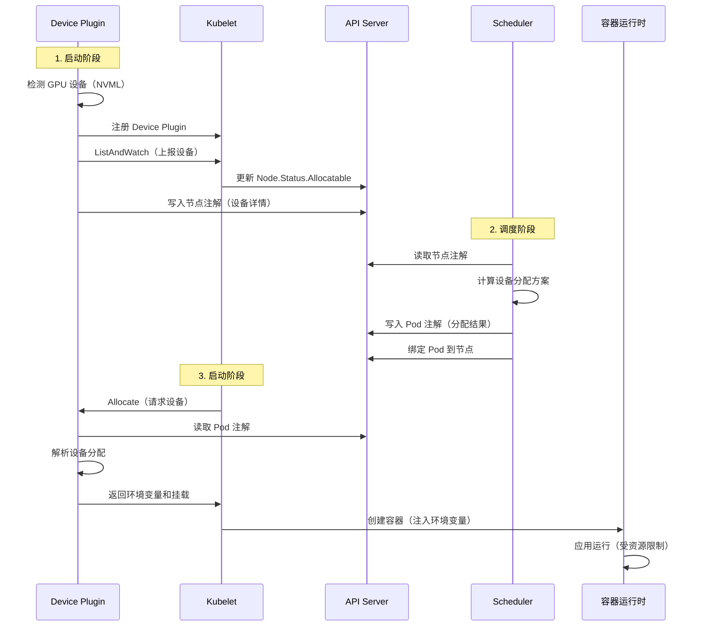

# HAMi Device Plugin 架构详解

## 目录

1. [概述](#概述)
2. [Device Plugin 的作用](#device-plugin-的作用)
3. [工作原理](#工作原理)
4. [与 Scheduler 的协作](#与-scheduler-的协作)
5. [核心功能](#核心功能)
6. [实现细节](#实现细节)

---

## 概述

Device Plugin 是 HAMi 系统中负责设备管理和资源分配的关键组件，运行在每个 Kubernetes 节点上。它是连接物理设备（GPU）和 Kubernetes 调度系统的桥梁。

### 核心职责

- **设备发现**：检测节点上的 GPU 设备
- **资源上报**：向 Kubernetes 上报设备资源
- **设备分配**：为 Pod 分配具体的 GPU 设备
- **资源隔离**：通过容器运行时实现资源隔离

---

## Device Plugin 的作用

### 1. 设备发现与注册

Device Plugin 启动后会：

1. **检测物理设备**
   - 使用 NVML（NVIDIA Management Library）枚举 GPU
   - 获取设备信息：UUID、显存大小、算力、NUMA 节点等
   - 检测设备健康状态

2. **注册到 Kubernetes**
   - 通过 Device Plugin API 向 kubelet 注册
   - 上报设备资源到 `node.status.allocatable`
   - 例如：`nvidia.com/gpu: 8`

3. **写入节点注解**
   - 将详细的设备信息写入节点的 Annotations
   - 注解名称：`hami.io/node-nvidia-register`
   - 格式：JSON 编码的设备列表
   - Scheduler 通过读取这些注解获取设备详情

**示例注解内容**：
```json
[
  {
    "id": "GPU-12345678-1234-1234-1234-123456789012",
    "index": 0,
    "count": 1,
    "devmem": 16384,
    "devcore": 100,
    "type": "NVIDIA-GeForce-RTX-3090",
    "numa": 0,
    "health": true
  },
  {
    "id": "GPU-87654321-4321-4321-4321-210987654321",
    "index": 1,
    "count": 1,
    "devmem": 16384,
    "devcore": 100,
    "type": "NVIDIA-GeForce-RTX-3090",
    "numa": 0,
    "health": true
  }
]
```

### 2. 资源上报（ListAndWatch）

Device Plugin 实现了 Kubernetes Device Plugin API 的 `ListAndWatch` 方法：

```go
func (m *NvidiaDevicePlugin) ListAndWatch(e *pluginapi.Empty, s pluginapi.DevicePlugin_ListAndWatchServer) error {
    // 1. 发现所有 GPU 设备
    devices := discoverGPUs()
    
    // 2. 构造设备列表
    devs := make([]*pluginapi.Device, 0)
    for _, dev := range devices {
        devs = append(devs, &pluginapi.Device{
            ID:     dev.UUID,
            Health: pluginapi.Healthy,
        })
    }
    
    // 3. 发送给 kubelet
    s.Send(&pluginapi.ListAndWatchResponse{Devices: devs})
    
    // 4. 持续监控设备状态变化
    for {
        select {
        case <-healthCheck:
            // 设备状态变化时重新发送
            s.Send(&pluginapi.ListAndWatchResponse{Devices: updatedDevs})
        }
    }
}
```

**作用**：
- kubelet 通过此接口获取节点上的设备列表
- 设备状态变化时实时通知 kubelet
- kubelet 更新 `node.status.allocatable` 和 `node.status.capacity`

### 3. 设备分配（Allocate）

当 Pod 被调度到节点后，kubelet 调用 Device Plugin 的 `Allocate` 方法：

```go
func (m *NvidiaDevicePlugin) Allocate(ctx context.Context, reqs *pluginapi.AllocateRequest) (*pluginapi.AllocateResponse, error) {
    responses := pluginapi.AllocateResponse{}
    
    for _, req := range reqs.ContainerRequests {
        // 1. 读取 Pod 注解，获取 Scheduler 的分配决策
        podAnnotations := getPodAnnotations(ctx)
        allocatedDevices := podAnnotations["hami.io/vgpu-devices-to-allocate"]
        
        // 2. 解析分配的设备 UUID
        deviceUUIDs := parseDeviceAllocation(allocatedDevices)
        
        // 3. 构造容器响应
        response := &pluginapi.ContainerAllocateResponse{
            Envs: map[string]string{
                // 设置可见的 GPU
                "NVIDIA_VISIBLE_DEVICES": strings.Join(deviceUUIDs, ","),
                // 设置显存限制（通过 vGPU 库）
                "CUDA_DEVICE_MEMORY_LIMIT": getMemoryLimit(allocatedDevices),
                // 设置算力限制
                "CUDA_DEVICE_SM_LIMIT": getCoreLimit(allocatedDevices),
            },
            Mounts: []*pluginapi.Mount{
                // 挂载 vGPU 库
                {
                    ContainerPath: "/usr/local/vgpu",
                    HostPath:      "/usr/local/vgpu",
                    ReadOnly:      true,
                },
            },
        }
        
        responses.ContainerResponses = append(responses.ContainerResponses, response)
    }
    
    return &responses, nil
}
```

**作用**：
- 读取 Scheduler 写入的设备分配注解
- 设置容器环境变量（`NVIDIA_VISIBLE_DEVICES` 等）
- 挂载必要的文件和库（vGPU 库、设备文件）
- 实现细粒度资源隔离（显存、算力限制）

### 4. 资源隔离实现

Device Plugin 通过多种机制实现资源隔离：

#### 4.1 设备可见性隔离

```bash
# 通过环境变量控制容器可见的 GPU
NVIDIA_VISIBLE_DEVICES=GPU-12345678-1234-1234-1234-123456789012
```

#### 4.2 显存隔离

```bash
# 通过 vGPU 库拦截 CUDA API，限制显存分配
CUDA_DEVICE_MEMORY_LIMIT=4096  # 限制为 4GB
```

**实现原理**：
- vGPU 库通过 `LD_PRELOAD` 拦截 CUDA 内存分配函数
- 当容器尝试分配超过限制的显存时，返回错误
- 对应用透明，无需修改代码

#### 4.3 算力隔离

```bash
# 限制 GPU 算力使用
CUDA_DEVICE_SM_LIMIT=50  # 限制为 50% 算力
```

**实现原理**：
- 使用 CUDA MPS（Multi-Process Service）或时间片调度
- 限制 SM（Streaming Multiprocessor）的使用比例

---

## 工作原理

### 完整流程图



### 关键步骤详解

#### 步骤 1：设备发现

```go
// pkg/device-plugin/nvidiadevice/server.go
func (m *NvidiaDevicePlugin) Start() error {
    // 1. 使用 NVML 枚举 GPU
    nvml.Init()
    defer nvml.Shutdown()
    
    count, _ := nvml.DeviceGetCount()
    devices := make([]*DeviceInfo, 0)
    
    for i := 0; i < count; i++ {
        device, _ := nvml.DeviceGetHandleByIndex(i)
        uuid, _ := device.GetUUID()
        memory, _ := device.GetMemoryInfo()
        
        devices = append(devices, &DeviceInfo{
            ID:      uuid,
            Index:   uint(i),
            Devmem:  int32(memory.Total / 1024 / 1024), // 转换为 MB
            Devcore: 100,
            Health:  true,
        })
    }
    
    // 2. 写入节点注解
    m.updateNodeAnnotations(devices)
    
    return nil
}
```

#### 步骤 2：握手机制

Device Plugin 和 Scheduler 通过节点注解实现握手：

```go
// Device Plugin 写入握手注解
annotations["hami.io/node-handshake"] = "Ready_" + time.Now().Format(time.DateTime)

// Scheduler 定期检查握手注解
handshake := node.Annotations["hami.io/node-handshake"]
if strings.Contains(handshake, "Ready") {
    // Device Plugin 已就绪
    timestamp := strings.Split(handshake, "_")[1]
    // 检查时间戳，判断是否超时
}
```

**握手状态**：
- `Ready_<timestamp>`: Device Plugin 正常运行
- `Requesting_<timestamp>`: Scheduler 请求更新设备信息
- `Deleted`: 设备已下线

#### 步骤 3：设备分配协议

Scheduler 和 Device Plugin 通过 Pod 注解传递分配信息：

**Scheduler 写入**：
```yaml
annotations:
  hami.io/vgpu-devices-to-allocate: "GPU-uuid-1,NVIDIA,4096,50:GPU-uuid-2,NVIDIA,4096,50"
```

**格式说明**：
- 使用 `:` 分隔多个设备
- 每个设备包含：`UUID,类型,显存(MB),算力(%)`
- Device Plugin 解析此注解，配置容器环境

---

## 与 Scheduler 的协作

### 数据流向

```
┌─────────────────┐         ┌──────────────────┐         ┌─────────────────┐
│  Device Plugin  │         │   Node Annotations│         │    Scheduler    │
│   (每个节点)     │         │     (etcd)       │         │   (集群级别)     │
└─────────────────┘         └──────────────────┘         └─────────────────┘
        │                            │                            │
        │  1. 写入设备信息            │                            │
        ├───────────────────────────>│                            │
        │                            │                            │
        │                            │  2. 读取设备信息            │
        │                            │<───────────────────────────┤
        │                            │                            │
        │                            │  3. 写入分配结果            │
        │                            │<───────────────────────────┤
        │                            │                            │
        │  4. 读取分配结果            │                            │
        │<───────────────────────────┤                            │
        │                            │                            │
```

### 职责分工

| 组件 | 职责 | 数据来源 |
|------|------|----------|
| **Device Plugin** | 设备发现、资源上报、设备分配、资源隔离 | NVML、Pod 注解 |
| **Scheduler** | 调度决策、设备选择、资源计算 | Node 注解、Pod 请求 |
| **Node 注解** | 数据交换媒介 | Device Plugin 写入，Scheduler 读取 |
| **Pod 注解** | 分配结果传递 | Scheduler 写入，Device Plugin 读取 |

### 为什么需要这种设计？

1. **解耦**：Device Plugin 和 Scheduler 独立开发和部署
2. **可扩展**：支持多种设备类型（NVIDIA、AMD、华为昇腾）
3. **容错**：组件故障不影响其他组件
4. **持久化**：注解存储在 etcd，支持故障恢复

---

## 核心功能

### 1. MIG 模式支持

MIG（Multi-Instance GPU）允许将一个物理 GPU 分割为多个独立实例：

```go
// 检测 MIG 设备
func (m *NvidiaDevicePlugin) discoverMIGDevices() []*DeviceInfo {
    devices := make([]*DeviceInfo, 0)
    
    // 枚举 MIG 实例
    count, _ := nvml.DeviceGetCount()
    for i := 0; i < count; i++ {
        device, _ := nvml.DeviceGetHandleByIndex(i)
        
        // 检查是否启用 MIG
        mode, _ := device.GetMigMode()
        if mode == nvml.DEVICE_MIG_ENABLE {
            // 枚举 MIG 实例
            migDevices, _ := device.GetMigDeviceHandleByIndex(0)
            for _, mig := range migDevices {
                uuid, _ := mig.GetUUID()
                memory, _ := mig.GetMemoryInfo()
                
                devices = append(devices, &DeviceInfo{
                    ID:      uuid,
                    Mode:    "mig",
                    Devmem:  int32(memory.Total / 1024 / 1024),
                    // MIG 实例的算力取决于配置
                })
            }
        }
    }
    
    return devices
}
```

### 2. 拓扑感知

Device Plugin 检测 GPU 之间的连接关系（NVLink、PCIe）：

```go
// 计算设备拓扑分数
func (m *NvidiaDevicePlugin) calculateTopologyScores() DevicePairScores {
    scores := make(DevicePairScores, 0)
    
    count, _ := nvml.DeviceGetCount()
    for i := 0; i < count; i++ {
        device1, _ := nvml.DeviceGetHandleByIndex(i)
        uuid1, _ := device1.GetUUID()
        
        pairScore := DevicePairScore{
            ID:     uuid1,
            Scores: make(map[string]int),
        }
        
        for j := 0; j < count; j++ {
            if i == j {
                continue
            }
            
            device2, _ := nvml.DeviceGetHandleByIndex(j)
            uuid2, _ := device2.GetUUID()
            
            // 获取设备间连接类型
            linkType, _ := device1.GetTopologyCommonAncestor(device2)
            
            // 根据连接类型打分
            score := 0
            switch linkType {
            case nvml.TOPOLOGY_NVLINK:
                score = 100  // NVLink 连接，最高分
            case nvml.TOPOLOGY_SINGLE:
                score = 80   // 同一 PCIe switch
            case nvml.TOPOLOGY_MULTIPLE:
                score = 60   // 不同 PCIe switch
            case nvml.TOPOLOGY_HOSTBRIDGE:
                score = 40   // 跨 CPU socket
            case nvml.TOPOLOGY_NODE:
                score = 20   // 跨 NUMA 节点
            }
            
            pairScore.Scores[uuid2] = score
        }
        
        scores = append(scores, pairScore)
    }
    
    return scores
}
```

**写入节点注解**：
```go
annotations["hami.io/node-nvidia-score"] = json.Marshal(scores)
```

**Scheduler 使用**：
- 当 Pod 请求多个 GPU 时，优先选择 NVLink 连接的 GPU
- 提高多 GPU 训练的通信性能

### 3. NUMA 感知

```go
// 获取设备的 NUMA 节点
func (m *NvidiaDevicePlugin) getDeviceNUMA(device nvml.Device) int {
    // 读取设备的 PCI 信息
    pci, _ := device.GetPciInfo()
    
    // 从 sysfs 读取 NUMA 节点
    numaPath := fmt.Sprintf("/sys/bus/pci/devices/%s/numa_node", pci.BusId)
    data, _ := ioutil.ReadFile(numaPath)
    numa, _ := strconv.Atoi(strings.TrimSpace(string(data)))
    
    return numa
}
```

**作用**：
- Scheduler 可以根据 Pod 的 NUMA 亲和性选择设备
- 减少跨 NUMA 访问，提高性能

### 4. 健康检查

```go
func (m *NvidiaDevicePlugin) healthCheck() {
    ticker := time.NewTicker(30 * time.Second)
    defer ticker.Stop()
    
    for {
        select {
        case <-ticker.C:
            unhealthy := make([]string, 0)
            
            for _, dev := range m.devices {
                device, err := nvml.DeviceGetHandleByUUID(dev.ID)
                if err != nil {
                    unhealthy = append(unhealthy, dev.ID)
                    continue
                }
                
                // 检查设备状态
                temp, _ := device.GetTemperature(nvml.TEMPERATURE_GPU)
                if temp > 90 {
                    // 温度过高
                    unhealthy = append(unhealthy, dev.ID)
                }
                
                // 检查 ECC 错误
                eccErrors, _ := device.GetTotalEccErrors(nvml.MEMORY_ERROR_TYPE_UNCORRECTED, nvml.VOLATILE_ECC)
                if eccErrors > 0 {
                    unhealthy = append(unhealthy, dev.ID)
                }
            }
            
            if len(unhealthy) > 0 {
                // 通知 kubelet 设备不健康
                m.updateDeviceHealth(unhealthy)
            }
        }
    }
}
```

---

## 实现细节

### 目录结构

```
pkg/device-plugin/
├── nvidiadevice/
│   ├── server.go           # Device Plugin 主服务
│   ├── allocate.go         # Allocate 方法实现
│   ├── nvinternal/         # NVIDIA 内部实现
│   │   ├── cdi/            # CDI（Container Device Interface）
│   │   ├── nvml/           # NVML 封装
│   │   └── plugin/         # Plugin 核心逻辑
│   └── vgpu/               # vGPU 库集成
├── amddevice/              # AMD GPU 支持
└── ascenddevice/           # 华为昇腾支持
```

### 关键代码文件

#### 1. `server.go` - 主服务

```go
type NvidiaDevicePlugin struct {
    socket       string                    // Unix socket 路径
    devices      []*DeviceInfo            // 设备列表
    stop         chan struct{}            // 停止信号
    health       chan *pluginapi.Device   // 健康状态通道
    server       *grpc.Server             // gRPC 服务器
}

func (m *NvidiaDevicePlugin) Start() error {
    // 1. 发现设备
    m.discoverDevices()
    
    // 2. 启动 gRPC 服务
    m.serve()
    
    // 3. 注册到 kubelet
    m.register()
    
    // 4. 启动健康检查
    go m.healthCheck()
    
    return nil
}
```

#### 2. `allocate.go` - 设备分配

```go
func (m *NvidiaDevicePlugin) Allocate(ctx context.Context, reqs *pluginapi.AllocateRequest) (*pluginapi.AllocateResponse, error) {
    // 核心逻辑：
    // 1. 从 Pod 注解读取 Scheduler 的分配决策
    // 2. 设置容器环境变量
    // 3. 挂载必要的文件和库
    // 4. 返回给 kubelet
}
```

### 配置文件

Device Plugin 的配置通常通过 ConfigMap 传递：

```yaml
apiVersion: v1
kind: ConfigMap
metadata:
  name: hami-device-plugin-config
  namespace: kube-system
data:
  config.yaml: |
    # 设备分割数（每个物理 GPU 可以分割为多少个虚拟 GPU）
    deviceSplitCount: 10
    
    # 显存缩放因子（用于超分配）
    deviceMemoryScaling: 1.0
    
    # 算力缩放因子
    deviceCoreScaling: 1.0
    
    # 日志级别
    libCudaLogLevel: "0"  # 0=Error, 1=Warning, 3=Info, 4=Debug
    
    # 节点特定配置
    nodeconfig:
      - name: "gpu-node-1"
        deviceSplitCount: 5
        deviceMemoryScaling: 1.2
```

---

## 总结

### Device Plugin 的核心价值

1. **设备抽象**：将物理设备抽象为 Kubernetes 资源
2. **细粒度共享**：支持 GPU 的显存和算力级别共享
3. **资源隔离**：通过 vGPU 库实现强隔离
4. **拓扑感知**：优化多 GPU 应用的性能
5. **多设备支持**：统一接口支持多种设备类型

### 与 Scheduler 的配合

- **Device Plugin**：负责"能力"（设备发现、资源隔离）
- **Scheduler**：负责"策略"（调度决策、资源分配）
- **Node 注解**：作为通信桥梁

这种设计实现了关注点分离，使得系统更加灵活和可扩展。

### 扩展阅读

- [Kubernetes Device Plugin 官方文档](https://kubernetes.io/docs/concepts/extend-kubernetes/compute-storage-net/device-plugins/)
- [NVIDIA Device Plugin](https://github.com/NVIDIA/k8s-device-plugin)
- [NVML API 文档](https://docs.nvidia.com/deploy/nvml-api/)
- [HAMi 项目主页](https://github.com/Project-HAMi/HAMi)

