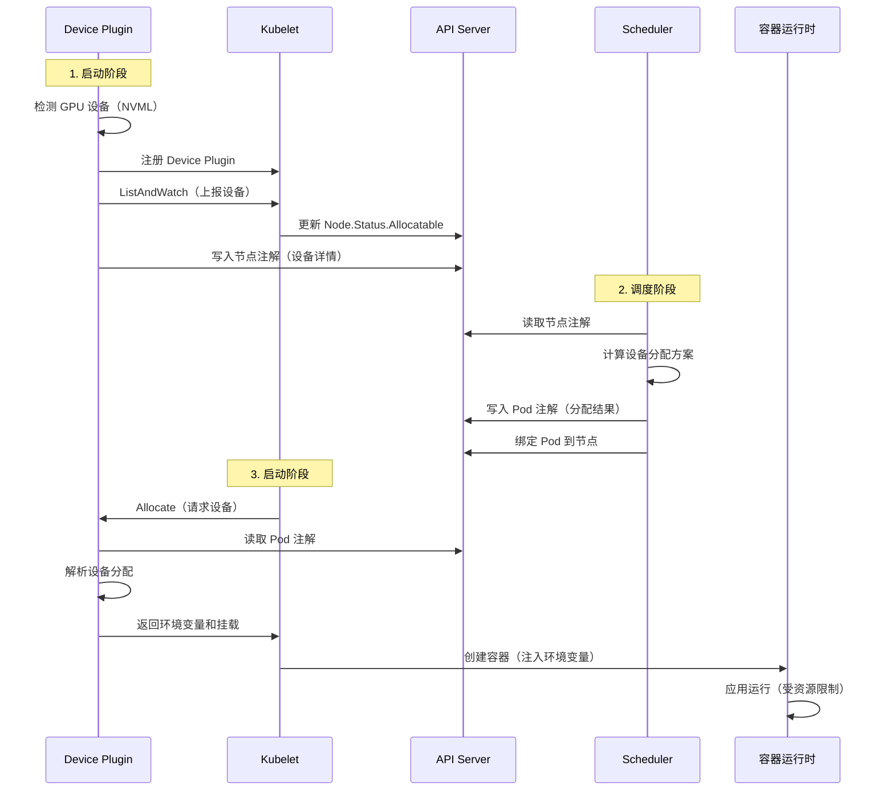

# HAMi Device Plugin 架构详解

## 目录

1. [概述](#概述)
2. [Device Plugin 的作用](#device-plugin-的作用)
3. [工作原理](#工作原理)
4. [与 Scheduler 的协作](#与-scheduler-的协作)
5. [核心功能](#核心功能)
6. [实现细节](#实现细节)

---

## 概述

Device Plugin 是 HAMi 系统中负责设备管理和资源分配的关键组件，运行在每个 Kubernetes 节点上。它是连接物理设备（GPU）和 Kubernetes 调度系统的桥梁。

### 核心职责

- **设备发现**：检测节点上的 GPU 设备
- **资源上报**：向 Kubernetes 上报设备资源
- **设备分配**：为 Pod 分配具体的 GPU 设备
- **资源隔离**：通过容器运行时实现资源隔离

---

## Device Plugin 的作用

### 1. 设备发现与注册

Device Plugin 启动后会：

1. **检测物理设备**
   - 使用 NVML（NVIDIA Management Library）枚举 GPU
   - 获取设备信息：UUID、显存大小、算力、NUMA 节点等
   - 检测设备健康状态

2. **注册到 Kubernetes**
   - 通过 Device Plugin API 向 kubelet 注册
   - 上报设备资源到 `node.status.allocatable`
   - 例如：`nvidia.com/gpu: 8`

3. **写入节点注解**
   - 将详细的设备信息写入节点的 Annotations
   - 注解名称：`hami.io/node-nvidia-register`
   - 格式：JSON 编码的设备列表
   - Scheduler 通过读取这些注解获取设备详情

**示例注解内容**：
```json
[
  {
    "id": "GPU-12345678-1234-1234-1234-123456789012",
    "index": 0,
    "count": 1,
    "devmem": 16384,
    "devcore": 100,
    "type": "NVIDIA-GeForce-RTX-3090",
    "numa": 0,
    "health": true
  },
  {
    "id": "GPU-87654321-4321-4321-4321-210987654321",
    "index": 1,
    "count": 1,
    "devmem": 16384,
    "devcore": 100,
    "type": "NVIDIA-GeForce-RTX-3090",
    "numa": 0,
    "health": true
  }
]
```

### 2. 资源上报（ListAndWatch）

Device Plugin 实现了 Kubernetes Device Plugin API 的 `ListAndWatch` 方法：

```go
func (m *NvidiaDevicePlugin) ListAndWatch(e *pluginapi.Empty, s pluginapi.DevicePlugin_ListAndWatchServer) error {
    // 1. 发现所有 GPU 设备
    devices := discoverGPUs()
    
    // 2. 构造设备列表
    devs := make([]*pluginapi.Device, 0)
    for _, dev := range devices {
        devs = append(devs, &pluginapi.Device{
            ID:     dev.UUID,
            Health: pluginapi.Healthy,
        })
    }
    
    // 3. 发送给 kubelet
    s.Send(&pluginapi.ListAndWatchResponse{Devices: devs})
    
    // 4. 持续监控设备状态变化
    for {
        select {
        case <-healthCheck:
            // 设备状态变化时重新发送
            s.Send(&pluginapi.ListAndWatchResponse{Devices: updatedDevs})
        }
    }
}
```

**作用**：
- kubelet 通过此接口获取节点上的设备列表
- 设备状态变化时实时通知 kubelet
- kubelet 更新 `node.status.allocatable` 和 `node.status.capacity`

### 3. 设备分配（Allocate）

当 Pod 被调度到节点后，kubelet 调用 Device Plugin 的 `Allocate` 方法。这是 HAMi 最核心的方法，实现了与 Scheduler 的协作和资源隔离。

#### 真实的 Allocate 流程（基于源码）

```go
// pkg/device-plugin/nvidiadevice/nvinternal/plugin/server.go:475
func (plugin *NvidiaDevicePlugin) Allocate(ctx context.Context, reqs *kubeletdevicepluginv1beta1.AllocateRequest) (*kubeletdevicepluginv1beta1.AllocateResponse, error) {
    responses := kubeletdevicepluginv1beta1.AllocateResponse{}
    nodename := os.Getenv(util.NodeNameEnvName)
    
    // 步骤 1: 获取当前正在分配的 Pod
    current, err := util.GetPendingPod(ctx, nodename)
    if err != nil {
        return &kubeletdevicepluginv1beta1.AllocateResponse{}, err
    }
    klog.Infof("Allocate pod name is %s/%s, annotation is %+v", current.Namespace, current.Name, current.Annotations)

    // 步骤 2: 遍历每个容器的设备请求
    for idx, req := range reqs.ContainerRequests {
        // 分支 1: MIG 模式的处理
        if strings.Contains(req.DevicesIDs[0], "MIG") {
            // MIG 设备的分配逻辑（较简单，直接使用 kubelet 传入的设备 ID）
            response, err := plugin.getAllocateResponse(req.DevicesIDs)
            responses.ContainerResponses = append(responses.ContainerResponses, response)
        } else {
            // 分支 2: 普通 GPU 模式（HAMi 的核心逻辑）
            
            // 2.1 从 Pod 注解读取 Scheduler 的分配决策
            currentCtr, devreq, err := GetNextDeviceRequest(nvidia.NvidiaGPUDevice, *current)
            klog.Infoln("deviceAllocateFromAnnotation=", devreq)
            
            // 2.2 验证设备数量是否匹配
            if len(devreq) != len(reqs.ContainerRequests[idx].DevicesIDs) {
                PodAllocationFailed(nodename, current, NodeLockNvidia)
                return &kubeletdevicepluginv1beta1.AllocateResponse{}, errors.New("device number not matched")
            }
            
            // 2.3 获取基础的分配响应（设置 NVIDIA_VISIBLE_DEVICES）
            response, err := plugin.getAllocateResponse(plugin.GetContainerDeviceStrArray(devreq))
            
            // 2.4 从注解中删除已处理的设备请求（避免重复处理）
            err = EraseNextDeviceTypeFromAnnotation(nvidia.NvidiaGPUDevice, *current)
            
            // 2.5 非 MIG 模式：注入 vGPU 资源隔离
            if plugin.operatingMode != "mig" {
                // 设置每个 GPU 的显存限制
                for i, dev := range devreq {
                    limitKey := fmt.Sprintf("CUDA_DEVICE_MEMORY_LIMIT_%v", i)
                    response.Envs[limitKey] = fmt.Sprintf("%vm", dev.Usedmem)
                }
                
                // 设置算力限制
                response.Envs["CUDA_DEVICE_SM_LIMIT"] = fmt.Sprint(devreq[0].Usedcores)
                
                // 设置缓存文件路径
                response.Envs["CUDA_DEVICE_MEMORY_SHARED_CACHE"] = fmt.Sprintf("%s/vgpu/%v.cache", hostHookPath, uuid.New().String())
                
                // 显存超分配标志
                if *plugin.schedulerConfig.DeviceMemoryScaling > 1 {
                    response.Envs["CUDA_OVERSUBSCRIBE"] = "true"
                }
                
                // 日志级别
                if *plugin.schedulerConfig.LogLevel != "" {
                    response.Envs["LIBCUDA_LOG_LEVEL"] = string(*plugin.schedulerConfig.LogLevel)
                }
                
                // 算力限制开关
                if plugin.schedulerConfig.DisableCoreLimit {
                    response.Envs[util.CoreLimitSwitch] = "disable"
                }
                
                // 创建容器专属的缓存目录
                cacheFileHostDirectory := fmt.Sprintf("%s/vgpu/containers/%s_%s", hostHookPath, current.UID, currentCtr.Name)
                os.RemoveAll(cacheFileHostDirectory)
                os.MkdirAll(cacheFileHostDirectory, 0777)
                
                // 挂载 vGPU 库和缓存目录
                response.Mounts = append(response.Mounts,
                    &kubeletdevicepluginv1beta1.Mount{
                        ContainerPath: fmt.Sprintf("%s/vgpu/libvgpu.so", hostHookPath),
                        HostPath:      GetLibPath(),  // 实际路径：/usr/local/vgpu/libvgpu.so.vX.X.X
                        ReadOnly:      true,
                    },
                    &kubeletdevicepluginv1beta1.Mount{
                        ContainerPath: fmt.Sprintf("%s/vgpu", hostHookPath),
                        HostPath:      cacheFileHostDirectory,
                        ReadOnly:      false,
                    },
                    &kubeletdevicepluginv1beta1.Mount{
                        ContainerPath: "/tmp/vgpulock",
                        HostPath:      "/tmp/vgpulock",
                        ReadOnly:      false,
                    },
                )
                
                // 检查是否禁用 vGPU 控制（通过容器环境变量 CUDA_DISABLE_CONTROL）
                found := false
                for _, val := range currentCtr.Env {
                    if val.Name == "CUDA_DISABLE_CONTROL" {
                        if t, _ := strconv.ParseBool(val.Value); t {
                            found = true
                            break
                        }
                    }
                }
                
                // 如果未禁用，挂载 ld.so.preload（注入 vGPU 库）
                if !found {
                    response.Mounts = append(response.Mounts, 
                        &kubeletdevicepluginv1beta1.Mount{
                            ContainerPath: "/etc/ld.so.preload",
                            HostPath:      hostHookPath + "/vgpu/ld.so.preload",
                            ReadOnly:      true,
                        },
                    )
                }
                
                // 如果存在 license 文件，也挂载进去
                if _, err := os.Stat(fmt.Sprintf("%s/vgpu/license", hostHookPath)); err == nil {
                    response.Mounts = append(response.Mounts, 
                        &kubeletdevicepluginv1beta1.Mount{
                            ContainerPath: "/tmp/license",
                            HostPath:      fmt.Sprintf("%s/vgpu/license", hostHookPath),
                            ReadOnly:      true,
                        },
                        &kubeletdevicepluginv1beta1.Mount{
                            ContainerPath: "/usr/bin/vgpuvalidator",
                            HostPath:      fmt.Sprintf("%s/vgpu/vgpuvalidator", hostHookPath),
                            ReadOnly:      true,
                        },
                    )
                }
            }
            
            responses.ContainerResponses = append(responses.ContainerResponses, response)
        }
    }
    
    // 步骤 3: 检查是否所有设备都已分配完成，如果是则释放节点锁
    PodAllocationTrySuccess(nodename, nvidia.NvidiaGPUDevice, NodeLockNvidia, current)
    
    return &responses, nil
}
```

#### 关键辅助函数

**1. GetNextDeviceRequest - 从注解读取设备分配**

```go
// pkg/device-plugin/nvidiadevice/nvinternal/plugin/util.go:52
func GetNextDeviceRequest(dtype string, p corev1.Pod) (corev1.Container, device.ContainerDevices, error) {
    // 解码 Pod 注解中的设备分配信息
    // 注解格式：hami.io/vgpu-devices-to-allocate: "GPU-uuid-1,NVIDIA,4096,50:GPU-uuid-2,NVIDIA,4096,50;..."
    pdevices, err := device.DecodePodDevices(device.InRequestDevices, p.Annotations)
    if err != nil {
        return corev1.Container{}, device.ContainerDevices{}, err
    }
    
    // 获取指定设备类型的分配信息
    pd, ok := pdevices[dtype]
    if !ok {
        return corev1.Container{}, device.ContainerDevices{}, errors.New("device request not found")
    }
    
    // 找到第一个有设备请求的容器
    for ctridx, ctrDevice := range pd {
        if len(ctrDevice) > 0 {
            return p.Spec.Containers[ctridx], ctrDevice, nil
        }
    }
    
    return corev1.Container{}, device.ContainerDevices{}, errors.New("device request not found")
}
```

**2. EraseNextDeviceTypeFromAnnotation - 删除已处理的设备请求**

```go
// pkg/device-plugin/nvidiadevice/nvinternal/plugin/util.go:72
func EraseNextDeviceTypeFromAnnotation(dtype string, p corev1.Pod) error {
    // 读取当前注解
    pdevices, err := device.DecodePodDevices(device.InRequestDevices, p.Annotations)
    if err != nil {
        return err
    }
    
    // 找到第一个有设备的容器，将其设备列表清空
    pd, ok := pdevices[dtype]
    if !ok {
        return errors.New("erase device annotation not found")
    }
    
    res := device.PodSingleDevice{}
    found := false
    for _, val := range pd {
        if found {
            res = append(res, val)
        } else {
            if len(val) > 0 {
                found = true
                res = append(res, device.ContainerDevices{})  // 清空已处理的容器
            } else {
                res = append(res, val)
            }
        }
    }
    
    // 更新 Pod 注解
    newannos := make(map[string]string)
    newannos[device.InRequestDevices[dtype]] = device.EncodePodSingleDevice(res)
    return util.PatchPodAnnotations(&p, newannos)
}
```

**3. PodAllocationTrySuccess - 检查是否所有设备都已分配**

```go
// pkg/device-plugin/nvidiadevice/nvinternal/plugin/util.go:440
func PodAllocationTrySuccess(nodeName string, devName string, lockName string, pod *corev1.Pod) {
    // 重新获取 Pod（确保注解是最新的）
    refreshed, err := client.GetClient().CoreV1().Pods(pod.Namespace).Get(context.Background(), pod.Name, metav1.GetOptions{})
    if err != nil {
        return
    }
    
    // 检查注解中是否还有待分配的设备
    annos := refreshed.Annotations[device.InRequestDevices[devName]]
    for _, val := range device.DevicesToHandle {
        if strings.Contains(annos, val) {
            return  // 还有其他设备类型未分配，不释放锁
        }
    }
    
    // 所有设备都已分配完成，释放节点锁
    klog.Infof("All devices allocate success, releasing lock")
    PodAllocationSuccess(nodeName, pod, lockName)
}
```

#### 核心设计要点

**1. 与 Scheduler 的协作**
- Scheduler 将分配决策写入 Pod 注解：`hami.io/vgpu-devices-to-allocate`
- Device Plugin 读取注解，获取要分配的设备 UUID、显存、算力
- 处理完一个容器后，从注解中删除该容器的设备信息
- 所有容器处理完后，释放节点锁

**2. 注解格式**
```
hami.io/vgpu-devices-to-allocate: "GPU-uuid-1,NVIDIA,4096,50:GPU-uuid-2,NVIDIA,4096,50;GPU-uuid-3,NVIDIA,2048,30"
                                   └─────────── 容器1的设备 ──────────┘ └────── 容器2的设备 ─────┘
                                   
格式说明：
- 使用 ";" 分隔不同容器的设备
- 使用 ":" 分隔同一容器的多个设备
- 每个设备：UUID,类型,显存(MB),算力(%)
```

**3. 资源隔离机制**
- 通过环境变量传递资源限制：
  - `CUDA_DEVICE_MEMORY_LIMIT_0=4096m`：限制 GPU 0 的显存
  - `CUDA_DEVICE_SM_LIMIT=50`：限制算力为 50%
- 通过 `LD_PRELOAD` 注入 vGPU 库：
  - 挂载 `/etc/ld.so.preload` 指向 vGPU 配置
  - 容器启动时自动加载 `libvgpu.so`
  - vGPU 库拦截 CUDA API，实现资源限制

**4. 容器隔离**
- 每个容器有独立的缓存目录：`/usr/local/vgpu/containers/{pod-uid}_{container-name}`
- 避免不同容器之间的资源冲突
- 支持同一 Pod 的多个容器使用不同的 GPU

**作用总结**：
- ✅ 读取 Scheduler 写入的设备分配注解
- ✅ 设置容器环境变量（`NVIDIA_VISIBLE_DEVICES`、`CUDA_DEVICE_MEMORY_LIMIT_*`、`CUDA_DEVICE_SM_LIMIT`）
- ✅ 挂载 vGPU 库和配置文件（`libvgpu.so`、`ld.so.preload`）
- ✅ 创建容器专属的缓存目录
- ✅ 实现细粒度资源隔离（显存、算力限制）
- ✅ 支持多容器、多设备类型的复杂场景
- ✅ 处理完成后释放节点锁

### 4. 资源隔离实现

Device Plugin 通过多种机制实现资源隔离：

#### 4.1 设备可见性隔离

```bash
# 通过环境变量控制容器可见的 GPU
NVIDIA_VISIBLE_DEVICES=GPU-12345678-1234-1234-1234-123456789012
```

#### 4.2 显存隔离

```bash
# 通过 vGPU 库拦截 CUDA API，限制显存分配
CUDA_DEVICE_MEMORY_LIMIT=4096  # 限制为 4GB
```

**实现原理**：
- vGPU 库通过 `LD_PRELOAD` 拦截 CUDA 内存分配函数
- 当容器尝试分配超过限制的显存时，返回错误
- 对应用透明，无需修改代码

#### 4.3 算力隔离

```bash
# 限制 GPU 算力使用
CUDA_DEVICE_SM_LIMIT=50  # 限制为 50% 算力
```

**实现原理**：
- 使用 CUDA MPS（Multi-Process Service）或时间片调度
- 限制 SM（Streaming Multiprocessor）的使用比例

---

## 工作原理

### 完整流程图



### 关键步骤详解

#### 步骤 1：设备发现

```go
// pkg/device-plugin/nvidiadevice/server.go
func (m *NvidiaDevicePlugin) Start() error {
    // 1. 使用 NVML 枚举 GPU
    nvml.Init()
    defer nvml.Shutdown()
    
    count, _ := nvml.DeviceGetCount()
    devices := make([]*DeviceInfo, 0)
    
    for i := 0; i < count; i++ {
        device, _ := nvml.DeviceGetHandleByIndex(i)
        uuid, _ := device.GetUUID()
        memory, _ := device.GetMemoryInfo()
        
        devices = append(devices, &DeviceInfo{
            ID:      uuid,
            Index:   uint(i),
            Devmem:  int32(memory.Total / 1024 / 1024), // 转换为 MB
            Devcore: 100,
            Health:  true,
        })
    }
    
    // 2. 写入节点注解
    m.updateNodeAnnotations(devices)
    
    return nil
}
```

#### 步骤 2：握手机制

Device Plugin 和 Scheduler 通过节点注解实现握手：

```go
// Device Plugin 写入握手注解
annotations["hami.io/node-handshake"] = "Ready_" + time.Now().Format(time.DateTime)

// Scheduler 定期检查握手注解
handshake := node.Annotations["hami.io/node-handshake"]
if strings.Contains(handshake, "Ready") {
    // Device Plugin 已就绪
    timestamp := strings.Split(handshake, "_")[1]
    // 检查时间戳，判断是否超时
}
```

**握手状态**：
- `Ready_<timestamp>`: Device Plugin 正常运行
- `Requesting_<timestamp>`: Scheduler 请求更新设备信息
- `Deleted`: 设备已下线

#### 步骤 3：设备分配协议

Scheduler 和 Device Plugin 通过 Pod 注解传递分配信息：

**Scheduler 写入**：
```yaml
annotations:
  hami.io/vgpu-devices-to-allocate: "GPU-uuid-1,NVIDIA,4096,50:GPU-uuid-2,NVIDIA,4096,50"
```

**格式说明**：
- 使用 `:` 分隔多个设备
- 每个设备包含：`UUID,类型,显存(MB),算力(%)`
- Device Plugin 解析此注解，配置容器环境

---

## 与 Scheduler 的协作

### 数据流向

```
┌─────────────────┐         ┌──────────────────┐         ┌─────────────────┐
│  Device Plugin  │         │   Node Annotations│         │    Scheduler    │
│   (每个节点)     │         │     (etcd)       │         │   (集群级别)     │
└─────────────────┘         └──────────────────┘         └─────────────────┘
        │                            │                            │
        │  1. 写入设备信息            │                            │
        ├───────────────────────────>│                            │
        │                            │                            │
        │                            │  2. 读取设备信息            │
        │                            │<───────────────────────────┤
        │                            │                            │
        │                            │  3. 写入分配结果            │
        │                            │<───────────────────────────┤
        │                            │                            │
        │  4. 读取分配结果            │                            │
        │<───────────────────────────┤                            │
        │                            │                            │
```

### 职责分工

| 组件 | 职责 | 数据来源 |
|------|------|----------|
| **Device Plugin** | 设备发现、资源上报、设备分配、资源隔离 | NVML、Pod 注解 |
| **Scheduler** | 调度决策、设备选择、资源计算 | Node 注解、Pod 请求 |
| **Node 注解** | 数据交换媒介 | Device Plugin 写入，Scheduler 读取 |
| **Pod 注解** | 分配结果传递 | Scheduler 写入，Device Plugin 读取 |

### 为什么需要这种设计？

1. **解耦**：Device Plugin 和 Scheduler 独立开发和部署
2. **可扩展**：支持多种设备类型（NVIDIA、AMD、华为昇腾）
3. **容错**：组件故障不影响其他组件
4. **持久化**：注解存储在 etcd，支持故障恢复

---

## 核心功能

### 1. MIG 模式支持

MIG（Multi-Instance GPU）允许将一个物理 GPU 分割为多个独立实例：

```go
// 检测 MIG 设备
func (m *NvidiaDevicePlugin) discoverMIGDevices() []*DeviceInfo {
    devices := make([]*DeviceInfo, 0)
    
    // 枚举 MIG 实例
    count, _ := nvml.DeviceGetCount()
    for i := 0; i < count; i++ {
        device, _ := nvml.DeviceGetHandleByIndex(i)
        
        // 检查是否启用 MIG
        mode, _ := device.GetMigMode()
        if mode == nvml.DEVICE_MIG_ENABLE {
            // 枚举 MIG 实例
            migDevices, _ := device.GetMigDeviceHandleByIndex(0)
            for _, mig := range migDevices {
                uuid, _ := mig.GetUUID()
                memory, _ := mig.GetMemoryInfo()
                
                devices = append(devices, &DeviceInfo{
                    ID:      uuid,
                    Mode:    "mig",
                    Devmem:  int32(memory.Total / 1024 / 1024),
                    // MIG 实例的算力取决于配置
                })
            }
        }
    }
    
    return devices
}
```

### 2. 拓扑感知

Device Plugin 检测 GPU 之间的连接关系（NVLink、PCIe）：

```go
// 计算设备拓扑分数
func (m *NvidiaDevicePlugin) calculateTopologyScores() DevicePairScores {
    scores := make(DevicePairScores, 0)
    
    count, _ := nvml.DeviceGetCount()
    for i := 0; i < count; i++ {
        device1, _ := nvml.DeviceGetHandleByIndex(i)
        uuid1, _ := device1.GetUUID()
        
        pairScore := DevicePairScore{
            ID:     uuid1,
            Scores: make(map[string]int),
        }
        
        for j := 0; j < count; j++ {
            if i == j {
                continue
            }
            
            device2, _ := nvml.DeviceGetHandleByIndex(j)
            uuid2, _ := device2.GetUUID()
            
            // 获取设备间连接类型
            linkType, _ := device1.GetTopologyCommonAncestor(device2)
            
            // 根据连接类型打分
            score := 0
            switch linkType {
            case nvml.TOPOLOGY_NVLINK:
                score = 100  // NVLink 连接，最高分
            case nvml.TOPOLOGY_SINGLE:
                score = 80   // 同一 PCIe switch
            case nvml.TOPOLOGY_MULTIPLE:
                score = 60   // 不同 PCIe switch
            case nvml.TOPOLOGY_HOSTBRIDGE:
                score = 40   // 跨 CPU socket
            case nvml.TOPOLOGY_NODE:
                score = 20   // 跨 NUMA 节点
            }
            
            pairScore.Scores[uuid2] = score
        }
        
        scores = append(scores, pairScore)
    }
    
    return scores
}
```

**写入节点注解**：
```go
annotations["hami.io/node-nvidia-score"] = json.Marshal(scores)
```

**Scheduler 使用**：
- 当 Pod 请求多个 GPU 时，优先选择 NVLink 连接的 GPU
- 提高多 GPU 训练的通信性能

### 3. NUMA 感知

```go
// 获取设备的 NUMA 节点
func (m *NvidiaDevicePlugin) getDeviceNUMA(device nvml.Device) int {
    // 读取设备的 PCI 信息
    pci, _ := device.GetPciInfo()
    
    // 从 sysfs 读取 NUMA 节点
    numaPath := fmt.Sprintf("/sys/bus/pci/devices/%s/numa_node", pci.BusId)
    data, _ := ioutil.ReadFile(numaPath)
    numa, _ := strconv.Atoi(strings.TrimSpace(string(data)))
    
    return numa
}
```

**作用**：
- Scheduler 可以根据 Pod 的 NUMA 亲和性选择设备
- 减少跨 NUMA 访问，提高性能

### 4. 健康检查

**实际的健康检查逻辑**（基于源码 `pkg/device/nvidia/device.go:288` 和 `pkg/scheduler/scheduler.go:register`）：

HAMi 的健康检查**不是**在 Device Plugin 中实现的，而是在 **Scheduler 的 register 方法**中定期调用。

```go
// pkg/scheduler/scheduler.go:register
func (s *Scheduler) register(labelSelector labels.Selector, printedLog map[string]bool) {
    // 获取所有节点
    rawNodes, _ := s.nodeLister.List(labelSelector)
    
    for _, val := range rawNodes {
        // 遍历所有设备类型
        for devhandsk, devInstance := range device.GetDevices() {
            // 1. 获取节点设备信息
            nodedevices, err := devInstance.GetNodeDevices(*val)
            if err != nil {
                continue
            }
            
            // 2. 调用 CheckHealth 检查设备健康状态
            health, needUpdate := devInstance.CheckHealth(devhandsk, val)
            
            // 3. 如果设备不健康，清理节点
            if !health {
                klog.Warning("Device is unhealthy, cleaning up node")
                devInstance.NodeCleanUp(val.Name)
                s.rmNodeDevices(val.Name, devhandsk)
                continue
            }
            
            // 4. 如果需要更新，重新读取设备信息
            if needUpdate {
                nodeInfo := &device.NodeInfo{
                    ID:      val.Name,
                    Node:    val,
                    Devices: make(map[string][]device.DeviceInfo, 0),
                }
                for _, deviceinfo := range nodedevices {
                    nodeInfo.Devices[deviceinfo.DeviceVendor] = append(nodeInfo.Devices[deviceinfo.DeviceVendor], *deviceinfo)
                }
                s.addNode(val.Name, nodeInfo)
            }
        }
    }
}
```

**CheckHealth 的实际实现**（`pkg/device/nvidia/device.go:288`）：

```go
func (dev *NvidiaGPUDevices) CheckHealth(devType string, n *corev1.Node) (bool, bool) {
    dev.mu.Lock()
    defer dev.mu.Unlock()
    
    // 1. 获取节点当前上报的 GPU 数量
    val, ok := n.Status.Allocatable[corev1.ResourceName(dev.config.ResourceCountName)]
    if !ok {
        return true, false
    }
    current := val.Value()
    
    // 2. 获取上次记录的 GPU 数量
    reported, ok := dev.ReportedGPUNum[n.Name]
    if !ok {
        // 首次检查，记录当前数量
        dev.ReportedGPUNum[n.Name] = current
        return true, true  // 健康，需要更新
    }
    
    // 3. 检查数量是否变化
    if current != reported {
        klog.InfoS("GPU count changed", 
            "node", n.Name, 
            "previous", reported, 
            "current", current)
        dev.ReportedGPUNum[n.Name] = current
        return true, true  // 健康，需要更新
    }
    
    // 4. 数量未变化，不需要更新
    return true, false  // 健康，不需要更新
}
```

**健康检查的触发时机**：

Scheduler 的 `RegisterFromNodeAnnotations` 方法会定期触发健康检查：

```go
func (s *Scheduler) RegisterFromNodeAnnotations() {
    ticker := time.NewTicker(time.Second * 15)  // 每 15 秒触发一次
    defer ticker.Stop()
    
    for {
        select {
        case <-s.nodeNotify:   // 节点变化事件
        case <-s.leaderNotify: // 成为 Leader 事件
        case <-ticker.C:       // 定时触发
        case <-s.stopCh:
            return
        }
        
        // 调用 register 方法，其中会调用 CheckHealth
        s.register(labelSelector, printedLog)
    }
}
```

**健康检查的逻辑**：

1. **检查设备数量变化**：
   - 读取节点的 `Status.Allocatable["nvidia.com/gpu"]`
   - 与上次记录的数量对比
   - 如果数量变化，标记需要更新

2. **不检查设备温度、ECC 错误等**：
   - HAMi 的 CheckHealth **不使用** NVML 检查设备状态
   - 只检查 Device Plugin 上报的设备数量
   - 依赖 Device Plugin 的健康检查机制

3. **返回值含义**：
   - `(true, false)`: 设备健康，不需要更新
   - `(true, true)`: 设备健康，需要更新（数量变化或首次检查）
   - `(false, false)`: 设备不健康，需要清理节点

**为什么不在 Device Plugin 中检查？**

- Device Plugin 有自己的健康检查机制（`ListAndWatch` 方法）
- Device Plugin 会向 kubelet 上报设备健康状态
- kubelet 会更新节点的 `Status.Allocatable`
- Scheduler 只需要检查 `Status.Allocatable` 的变化即可

**Device Plugin 的健康检查**（这才是真正检查设备状态的地方）：

```go
// pkg/device-plugin/nvidiadevice/nvinternal/rm/health.go
func (r *resourceManager) CheckHealth(stop <-chan any, unhealthy chan<- *Device, ...) error {
    // 使用 NVML 检查设备健康状态
    for {
        select {
        case <-stop:
            return nil
        case <-time.After(healthCheckInterval):
            // 检查每个设备
            for _, device := range r.devices {
                // 使用 NVML 检查设备状态
                ret := nvml.DeviceGetHandleByUUID(device.ID)
                if ret != nvml.SUCCESS {
                    // 设备不健康，通知 kubelet
                    unhealthy <- device
                }
            }
        }
    }
}
```

**总结**：

- ✅ **Scheduler 的 CheckHealth**：检查设备数量变化（每 15 秒）
- ✅ **Device Plugin 的健康检查**：使用 NVML 检查设备状态（持续监控）
- ✅ **两者配合**：Device Plugin 检测故障 → kubelet 更新 Allocatable → Scheduler 检测变化 → 清理节点

---

## 实现细节

### 目录结构

```
pkg/device-plugin/
├── nvidiadevice/
│   ├── server.go           # Device Plugin 主服务
│   ├── allocate.go         # Allocate 方法实现
│   ├── nvinternal/         # NVIDIA 内部实现
│   │   ├── cdi/            # CDI（Container Device Interface）
│   │   ├── nvml/           # NVML 封装
│   │   └── plugin/         # Plugin 核心逻辑
│   └── vgpu/               # vGPU 库集成
├── amddevice/              # AMD GPU 支持
└── ascenddevice/           # 华为昇腾支持
```

### 关键代码文件

#### 1. `server.go` - 主服务

```go
type NvidiaDevicePlugin struct {
    socket       string                    // Unix socket 路径
    devices      []*DeviceInfo            // 设备列表
    stop         chan struct{}            // 停止信号
    health       chan *pluginapi.Device   // 健康状态通道
    server       *grpc.Server             // gRPC 服务器
}

func (m *NvidiaDevicePlugin) Start() error {
    // 1. 发现设备
    m.discoverDevices()
    
    // 2. 启动 gRPC 服务
    m.serve()
    
    // 3. 注册到 kubelet
    m.register()
    
    // 4. 启动健康检查
    go m.healthCheck()
    
    return nil
}
```

#### 2. `allocate.go` - 设备分配

```go
func (m *NvidiaDevicePlugin) Allocate(ctx context.Context, reqs *pluginapi.AllocateRequest) (*pluginapi.AllocateResponse, error) {
    // 核心逻辑：
    // 1. 从 Pod 注解读取 Scheduler 的分配决策
    // 2. 设置容器环境变量
    // 3. 挂载必要的文件和库
    // 4. 返回给 kubelet
}
```

### 配置文件

Device Plugin 的配置通常通过 ConfigMap 传递：

```yaml
apiVersion: v1
kind: ConfigMap
metadata:
  name: hami-device-plugin-config
  namespace: kube-system
data:
  config.yaml: |
    # 设备分割数（每个物理 GPU 可以分割为多少个虚拟 GPU）
    deviceSplitCount: 10
    
    # 显存缩放因子（用于超分配）
    deviceMemoryScaling: 1.0
    
    # 算力缩放因子
    deviceCoreScaling: 1.0
    
    # 日志级别
    libCudaLogLevel: "0"  # 0=Error, 1=Warning, 3=Info, 4=Debug
    
    # 节点特定配置
    nodeconfig:
      - name: "gpu-node-1"
        deviceSplitCount: 5
        deviceMemoryScaling: 1.2
```

---

## 总结

### Device Plugin 的核心价值

1. **设备抽象**：将物理设备抽象为 Kubernetes 资源
2. **细粒度共享**：支持 GPU 的显存和算力级别共享
3. **资源隔离**：通过 vGPU 库实现强隔离
4. **拓扑感知**：优化多 GPU 应用的性能
5. **多设备支持**：统一接口支持多种设备类型

### 与 Scheduler 的配合

- **Device Plugin**：负责"能力"（设备发现、资源隔离）
- **Scheduler**：负责"策略"（调度决策、资源分配）
- **Node 注解**：作为通信桥梁

这种设计实现了关注点分离，使得系统更加灵活和可扩展。

### 扩展阅读

- [Kubernetes Device Plugin 官方文档](https://kubernetes.io/docs/concepts/extend-kubernetes/compute-storage-net/device-plugins/)
- [NVIDIA Device Plugin](https://github.com/NVIDIA/k8s-device-plugin)
- [NVML API 文档](https://docs.nvidia.com/deploy/nvml-api/)
- [HAMi 项目主页](https://github.com/Project-HAMi/HAMi)

