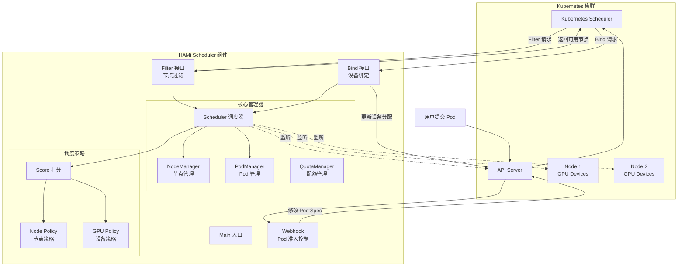
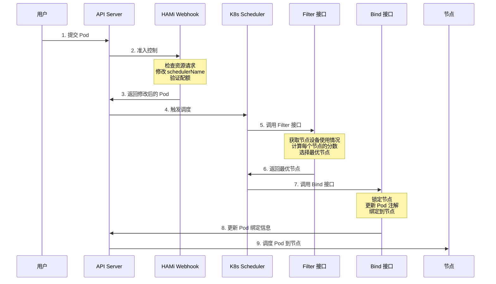

# HAMi Scheduler 架构详解

## 概述

HAMi (Heterogeneous AI Computing Virtualization Middleware) Scheduler 是一个 Kubernetes 调度器扩展器（Scheduler Extender），专门用于异构 AI 计算设备（GPU、NPU 等）的资源调度和分配。它通过 Webhook 和 HTTP 接口与 Kubernetes 调度器集成，实现了设备级别的细粒度资源管理。

## 核心设计理念

### 为什么需要 Scheduler Extender？

Kubernetes 原生调度器只能感知节点级别的资源（CPU、内存），无法感知单个 GPU 设备的使用情况。HAMi Scheduler 通过扩展器模式，在调度决策中加入设备级别的调度逻辑：

1. **细粒度资源管理**：支持 GPU 显存、算力的精确分配
2. **多设备支持**：统一管理 NVIDIA、AMD、华为昇腾等多种 AI 加速卡
3. **灵活的调度策略**：支持 Binpack（装箱）和 Spread（分散）两种策略

## 整体架构



## 调度流程详解

### 完整调度流程



### 流程步骤说明

#### 步骤 1-3：Webhook 准入控制阶段

**目的**：在 Pod 创建时进行资源验证和规范化

**关键操作**：
1. **资源检测**：检查 Pod 是否请求了 AI 设备资源
2. **调度器指定**：如果需要设备调度，设置 `schedulerName` 为 HAMi
3. **配额验证**：检查命名空间的资源配额是否足够
4. **注解添加**：为 Pod 添加必要的调度注解

**为什么这样做**？
- 提前验证可以避免无效的调度尝试
- 统一的 schedulerName 确保 Pod 被正确的调度器处理
- 配额检查防止资源超分

#### 步骤 4-6：Filter 过滤和打分阶段

**目的**：从候选节点中选出最适合的节点

**关键操作**：
1. **获取节点状态**：读取所有节点的设备使用情况
2. **过滤不可用节点**：排除资源不足、不健康的节点
3. **设备匹配**：为 Pod 的每个容器找到合适的设备
4. **打分排序**：根据调度策略计算节点分数
5. **选择最优节点**：返回分数最高的节点

**为什么这样做**？
- 分阶段过滤提高效率（先粗筛再细选）
- 打分机制支持灵活的调度策略
- 考虑 NUMA 亲和性提升性能

#### 步骤 7-9：Bind 绑定阶段

**目的**：将 Pod 绑定到选定的节点并分配具体设备

**关键操作**：
1. **节点锁定**：获取节点锁，防止并发冲突
2. **设备分配**：将具体的设备 ID 写入 Pod 注解
3. **状态更新**：更新 Pod 的绑定状态
4. **释放锁**：完成后释放节点锁

**为什么这样做**？
- 节点锁机制防止设备被重复分配
- 注解方式传递设备信息给 Device Plugin
- 原子操作保证数据一致性

## 核心组件详解

### 1. Scheduler 调度器核心

**职责**：
- 协调各个管理器的工作
- 处理 Filter 和 Bind 请求
- 维护集群设备状态的全局视图

**关键数据结构**：
```go
type Scheduler struct {
    nodeManager   *nodeManager      // 节点设备信息管理
    podManager    *PodManager       // Pod 设备分配记录
    quotaManager  *QuotaManager     // 资源配额管理
    cachedstatus  map[string]*NodeUsage  // Filter 返回的节点状态缓存
    overviewstatus map[string]*NodeUsage // 所有节点的完整状态
}
```

**为什么需要两个 status？**
- `cachedstatus`：只包含 Filter 请求中的候选节点，用于快速响应
- `overviewstatus`：包含所有节点，用于监控和指标采集

### 2. NodeManager 节点管理器

**职责**：
- 维护节点和设备的注册信息
- 监听节点变化事件
- 提供节点查询接口

**关键操作**：
```go
// 添加节点：从节点注解中解析设备信息
addNode(nodeID string, nodeInfo *NodeInfo)

// 删除节点：清理节点相关的所有数据
rmNode(nodeID string)

// 查询节点：返回节点的设备列表
GetNode(nodeID string) (*NodeInfo, error)
```

**为什么使用注解？**
- Device Plugin 将设备信息写入节点注解
- 注解是 Kubernetes 原生机制，无需额外存储
- 支持动态更新，无需重启调度器

### 3. PodManager Pod 管理器

**职责**：
- 记录 Pod 的设备分配结果
- 跟踪设备的实际使用情况
- 在 Pod 删除时释放设备

**为什么需要 PodManager？**
- Kubernetes 调度器是无状态的，需要持久化分配记录
- 支持调度器重启后恢复状态
- 提供设备使用情况的实时视图

### 4. QuotaManager 配额管理器

**职责**：
- 管理命名空间级别的资源配额
- 在准入阶段验证配额
- 跟踪配额使用情况

**为什么需要配额？**
- 防止单个租户占用过多资源
- 支持多租户环境的资源隔离
- 提供成本控制和计费依据

## 调度策略详解

### Node 级别策略

#### Binpack（装箱策略）- 默认

**原理**：优先使用已有 Pod 的节点，让资源集中

**适用场景**：
- 需要节省成本（可以关闭空闲节点）
- 集群规模较大，希望提高资源利用率
- 不关心单节点故障影响

**打分公式**：
```
score = weight × (used/total + usedCore/totalCore + usedMem/totalMem)
```
分数越高越优先（已使用越多越好）

#### Spread（分散策略）

**原理**：优先使用空闲节点，让负载分散

**适用场景**：
- 需要高可用（分散风险）
- 单节点性能有瓶颈
- 希望减少资源竞争

**打分公式**：同上，但分数越低越优先（空闲越多越好）

### GPU 级别策略

#### Binpack（装箱策略）

**原理**：优先使用已分配的 GPU，考虑 NUMA 亲和性

**特点**：
- 同 NUMA 节点的 GPU 优先级更高
- 已使用的 GPU 优先继续使用
- 减少 GPU 碎片化

#### Spread（分散策略）- 默认

**原理**：优先使用空闲 GPU，均衡负载

**特点**：
- 同 NUMA 节点的 GPU 优先级更低（强制分散）
- 空闲 GPU 优先使用
- 提高并发任务性能

### 如何选择策略？

| 场景 | Node 策略 | GPU 策略 | 原因 |
|------|----------|---------|------|
| 训练任务（大显存） | Binpack | Spread | 节省成本，避免单卡瓶颈 |
| 推理任务（高并发） | Spread | Spread | 高可用，降低延迟 |
| 开发测试 | Spread | Binpack | 隔离环境，快速分配 |
| 批处理任务 | Binpack | Binpack | 最大化利用率 |

## 关键技术点

### 1. 节点锁机制

**问题**：多个 Pod 同时调度到同一节点，可能导致设备重复分配

**解决方案**：
```go
// 使用 Kubernetes Lease 对象实现分布式锁
LockNode(node, pod) error
ReleaseNodeLock(node, pod)
```

**实现原理**：
- 每个节点对应一个 Lease 对象
- 获取锁 = 创建或更新 Lease
- 锁超时自动释放（默认 5 分钟）

### 2. 设备健康检查

**问题**：设备可能故障或被手动下线

**解决方案**：
```go
CheckHealth(deviceType, node) (healthy, needUpdate bool)
```

**检查项**：
- 节点注解是否存在
- 设备数量是否变化
- 设备状态是否正常

**处理流程**：
- 不健康 → 清理节点，触发 Pod 重新调度
- 需要更新 → 重新注册设备信息

### 3. 缓存同步机制

**问题**：调度器需要等待 Informer 缓存同步完成

**解决方案**：
```go
WaitForCacheSync(ctx) bool
```

**同步条件**：
1. Informer 已同步（HasSynced）
2. 至少成功执行一次 `getNodesUsage`
3. 当前实例是 Leader（如果启用选举）

**为什么重要？**
- 避免基于不完整数据做调度决策
- 防止设备重复分配
- 保证调度结果的正确性

### 4. Leader 选举

**问题**：多副本部署时，只能有一个实例处理调度请求

**解决方案**：
```go
LeaderManager.IsLeader() bool
```

**实现方式**：
- 基于 Kubernetes Lease 对象
- 自动故障转移
- Readiness 探针检查 Leader 状态

**为什么需要？**
- 避免多个实例同时修改状态
- 提高调度器的高可用性
- 支持滚动更新

## 数据流转

### 设备信息流

```
Device Plugin (节点) 
  → 写入 Node Annotation 
  → Scheduler 读取并解析 
  → 存入 NodeManager 
  → 用于调度决策
```

### Pod 分配信息流

```
Scheduler Filter 
  → 选择节点和设备 
  → 写入 Pod Annotation 
  → Device Plugin 读取 
  → 配置容器环境变量 
  → 容器使用指定设备
```

### 状态同步流

```
API Server Events 
  → Informer 缓存 
  → Event Handler 
  → 更新内存状态 
  → 影响后续调度
```

## 扩展点

### 如何添加新设备类型？

1. **实现 Devices 接口**：
```go
type Devices interface {
    MutateAdmission(ctr *corev1.Container, pod *corev1.Pod) (bool, error)
    CheckHealth(devType string, node *corev1.Node) (bool, bool)
    NodeCleanUp(nodeID string) error
    GetNodeDevices(node corev1.Node) ([]*DeviceInfo, error)
    // ... 其他方法
}
```

2. **注册设备**：
```go
device.DevicesMap[deviceType] = newDevice
```

3. **配置资源名称**：
```yaml
mydevice:
  resourceCountName: "vendor.com/device"
  resourceMemoryName: "vendor.com/device-memory"
```

### 如何自定义调度策略？

1. **修改打分逻辑**：
   - 实现 `ScoreNode` 方法
   - 返回自定义分数

2. **添加过滤条件**：
   - 在 `Fit` 方法中添加检查
   - 返回是否适配和原因

3. **通过注解控制**：
```yaml
annotations:
  hami.io/node-scheduler-policy: "custom"
  hami.io/gpu-scheduler-policy: "custom"
```

## 监控和调试

### 关键指标

- `hami_device_total`：节点设备总数
- `hami_device_used`：已分配设备数
- `hami_memory_total`：设备总显存
- `hami_memory_used`：已分配显存

### 日志级别

- `V(1)`：重要事件（调度成功/失败）
- `V(4)`：详细流程（节点过滤结果）
- `V(5)`：调试信息（设备状态详情）

### 常见问题排查

**问题 1：Pod 一直 Pending**
- 检查：`kubectl describe pod` 查看事件
- 原因：资源不足、配额超限、设备不健康
- 解决：增加资源、调整配额、修复设备

**问题 2：设备分配不均**
- 检查：调度策略配置
- 原因：使用了 Binpack 策略
- 解决：改用 Spread 策略

**问题 3：调度器不响应**
- 检查：Readiness 探针状态
- 原因：缓存未同步、不是 Leader
- 解决：等待同步完成、检查选举状态

## 最佳实践

1. **生产环境建议**：
   - 启用 Leader 选举（多副本高可用）
   - 设置合理的节点锁超时（避免死锁）
   - 配置资源配额（防止资源滥用）

2. **性能优化**：
   - 使用标签选择器过滤节点（减少计算量）
   - 调整 Informer 同步周期（平衡实时性和负载）
   - 启用 Profiling（定位性能瓶颈）

3. **安全加固**：
   - 启用 TLS（保护 API 通信）
   - 限制请求大小（防止 DoS 攻击）
   - 验证 Pod 权限（防止特权容器）

## 总结

HAMi Scheduler 通过 Kubernetes Scheduler Extender 模式，实现了对异构 AI 设备的细粒度调度。其核心设计包括：

1. **三阶段调度**：Webhook 准入 → Filter 过滤 → Bind 绑定
2. **三层管理**：节点管理 → 设备管理 → 配额管理
3. **双重策略**：节点级策略 + 设备级策略
4. **分布式协调**：节点锁 + Leader 选举

理解这些设计，可以帮助你：
- 正确配置调度策略
- 排查调度问题
- 扩展新的设备类型
- 优化调度性能

希望这份文档能帮助你深入理解 HAMi Scheduler 的工作原理！

